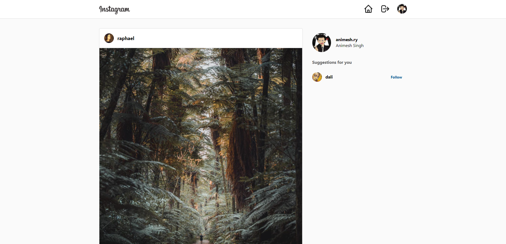

## EraGram

**Recreating Instagram's UI with React**: Who thought recreating one of most famous website could be this annoying? It's not a clone though

### Notice:
This project is currently uses firebase so the [website](https://vercel.com/animeshry/eragram) won't be active as the build contains my firebase credentials. You are free to try the app locally with the instructions below.

If the website is live, you can try it with these credentials
`ani16september@gmail.com, test123`

## Installation and Setup Instructions

#### Example:

Clone down this repository. You will need `yarn` and `npm` installed globally on your machine.

Installation:

`yarn install`

To Start Server:

`yarn start`

To Visit App:

`localhost:3000`

## Reflection

  - This project is just a side project for gromming my react skills and does not in anyway relate to the actual Instagram Website. I'm sure the devs at Facebook do a much better job than what I tried to mimick here.
  - Project utilizes custom hooks and uses userContext instead of redux, one of the problem I faced was -
    - Refactoring excess state and reducing extra firebase requests take a lot of time, setting up seperate context was authentication is a good choice when not using Redux.
  - What tools did I use to implement this project?
      - Project is bootstrapped with create-react-app and utilizes tailwind (best CSS framework) for all of my styling needs. The project uses basic email authentication from firebase and stores user and post data in the firestore. PropTypes were also pretty handy while using vanilla JS.

#### License:

This project is licensed under the MIT License - see the [LICENSE.md](/LICENSE) file for details.

